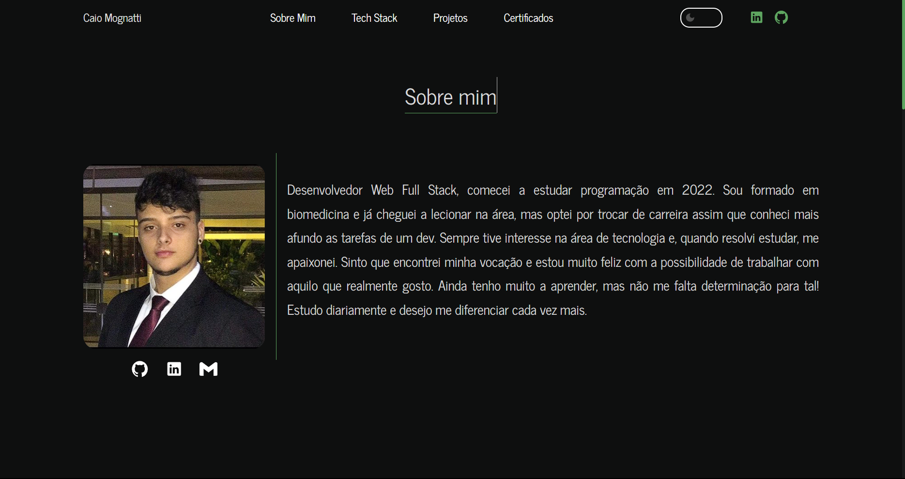
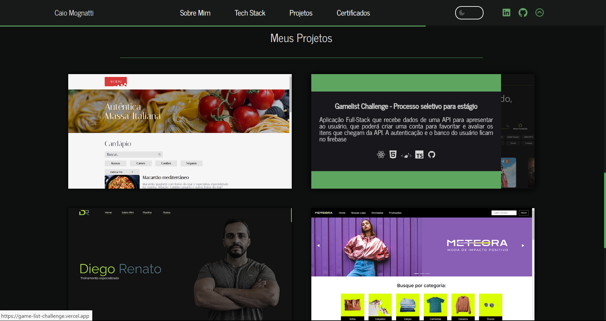
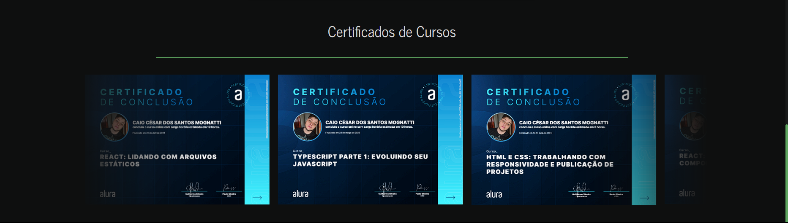

<h1 align='center'>Bem-vindo ao meu Porfólio </h1> 

- [x] Aqui você encontrará o código que criei para promover o meu trabalho e divulgar meus projetos. 
- [x] Você poderá ter uma melhor noção do que já sou capaz de fazer ao analisar os meu projetos!
- [x] Dê uma olhada nas tecnologias com as quais eu possuo experiência dando uma olhada na sessão "Tech Stack"
- [x] Nos vemos na entrevista  

<h2 align='center'>Preview do Site  </h2>
 

Página inicial com animação 
 

Cada projeto se abre como uma página de um caderno, externando a descrição do projeto
 

Efeito de carrossel infinito para os certificados

A tech stack não está no preview pois não iria caber em um único print 

